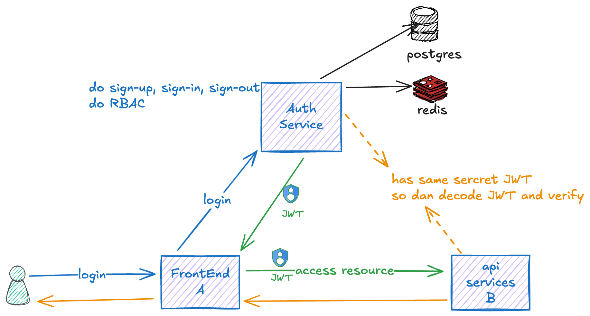

# Auth Service

## 🌟 Overview



The **Auth Service** is a microservice responsible for handling user authentication, authorization, and role-based access control (RBAC) in a distributed system. It provides a centralized solution for user management, token-based authentication using JSON Web Tokens (JWT), and access control for multiple API services. The service supports user sign-up, sign-in, sign-out, multi-factor authentication (MFA), and token revocation, ensuring secure access to protected resources.

### 🏗️ Architecture 
The system consists of three main components:
- **Frontend (A)**: The client application where users log in, sign up, or access protected resources.
- **Auth Service**: The core service that manages authentication, issues JWTs, and enforces RBAC.
- **API Services (B)**: Backend services that provide protected resources, accessible using JWTs issued by the Auth Service.

### 🚀 Usage Scenario
1. A user logs in via the frontend by sending credentials to the Auth Service.
2. The Auth Service validates the credentials and issues a JWT containing the user’s details and a list of accessible services with their roles.
3. The frontend sends the JWT to an API Service to access a protected resource.
4. The API Service verifies the JWT using a shared secret and checks if its own service UUID is in the JWT’s `services` array, along with the user’s role for that service.
5. If the token is valid and the user has access, the API Service grants the request; otherwise, it denies it.
6. Revoked tokens (e.g., after sign-out) are stored in Redis, accessible to all services for blacklist checks.

## Development 🧑‍💻

#### Prerequisites

- Docker and Docker Compose for containerized development.
- uv installed for dependency management.

#### Running the Service

1. Clone the repository:
2. Running the service:
    ```bash
    make up
    ```
3. Running the migrations:
    ```bash
    make exec
    # loc: /code/src
    alembic upgrade head
    ```

## Features

### Authentication 🔑
- `POST /api/v1/auth/sign-up`: Register a new user.
- `POST /api/v1/auth/sign-in`: Authenticate a user and issue a JWT.
- `DELETE /api/v1/auth/sign-out`: Invalidate a user’s session (sign out) and add the token to a Redis blacklist.
- `POST /api/v1/auth/verify-mfa`: Verify multi-factor authentication codes.
- `POST /api/v1/auth/refresh`: Refresh an expired JWT using a refresh token.

### User Management (Admin) 👤
- `GET /api/v1/admin/users`: Retrieve a list of all users (admin only).
- `GET /api/v1/admin/users/{user_uuid}`: Get details of a specific user (admin only).
- `PUT /api/v1/admin/users/{user_uuid}`: Update a user’s details (admin only).
- `DELETE /api/v1/admin/users/{user_uuid}`: Delete a user (admin only).

### Member Profile Management 🧑‍💻
- `GET /api/v1/me`: Retrieve the authenticated user’s details.
- `PUT /api/v1/me`: Update the authenticated user’s profile.
- `PUT /api/v1/me/password`: Update the user’s password.
- `PUT /api/v1/me/mfa`: Enable or update MFA settings.
- `GET /api/v1/me/mfa/qrcode`: Generate a QR code for MFA setup.

### Role Management 🎭
- `GET /api/v1/roles`: Retrieve all roles (admin only).
- `POST /api/v1/roles`: Create a new role (admin only).
- `GET /api/v1/roles/{role_id}`: Get details of a specific role (admin only).
- `PUT /api/v1/roles/{role_id}`: Update a role (admin only).
- `DELETE /api/v1/roles/{role_id}`: Delete a role (admin only).

### Service Management 🛠️
- `GET /api/v1/services`: Retrieve all services (admin only).
- `POST /api/v1/services`: Create a new service (admin only).
- `GET /api/v1/services/{service_uuid}`: Get details of a specific service (admin only).
- `PUT /api/v1/services/{service_uuid}`: Update a service (admin only).
- `DELETE /api/v1/services/{service_uuid}`: Delete a service (admin only).

## Security Features
- **JWT Authentication**: Uses JSON Web Tokens for stateless authentication, signed with a shared secret.
- **Rate-Limiting**: All API endpoints are rate-limited to prevent brute-force attacks.
- **Password Hashing**: Passwords are stored in the database as hashed values using a secure algorithm.
- **Token Revocation**: Revoked tokens are stored in Redis, accessible to all services for blacklist checks.
- **RBAC**: Role-based access control ensures users can only access endpoints permitted by their roles.
- **MFA**: Multi-factor authentication is supported for added security.

## Example JWT Payload
Below is a simplified example of a JWT payload issued by the Auth Service. The current implementation includes detailed user information and a `services` array, but this can be optimized (see "Things to Improve").

```json
{
  "created_at": "2025-03-17 01:20:41.960130+00:00",
  "created_by": null,
  "updated_at": "2025-03-21 03:09:44.881722+00:00",
  "updated_by": null,
  "uuid": "0195a1b0-517f-7460-90e6-7a034be7a589",
  "username": "johndoe",
  "firstname": "John",
  "midname": "Mid Name",
  "lastname": "Choy",
  "email": "johndoe@email.com",
  "phone": "081214341127",
  "telegram": null,
  "is_active": true,
  "mfa_enabled": false,
  "role": "superadmin",
  "services": [
    {
      "uuid": "0195a20d-436d-7eb5-a419-a699b876f020",
      "name": "central",
      "description": "central service",
      "role": "superadmin",
      "member_is_active": true,
      "service_is_active": true
    }
  ],
  "expire_time": 1742536391.0627003
}
```

### Notes on Current JWT
The current JWT payload includes more data, such as `email`, `phone`, and a `services` array with the user’s accessible services and roles. This has been simplified in the example above to reduce token size and improve security, as sensitive data should not be stored in the JWT.

## ✅ Things to Improve 
- [ ] **Switch to Asymmetric Keys**: Replace the shared secret with a private/public key pair for JWT signing and verification to eliminate the risk of a compromised shared secret.
- [ ] **Simplify JWT Payload**: Remove sensitive data (e.g., `email`, `phone`) and the `services` array from the JWT to reduce its size and minimize data exposure risks.
- [ ] **Centralize Permission Checks**: Store service access and roles in a database (cached in Redis) and create an endpoint (e.g., `GET /api/v1/auth/permissions`) for services to dynamically check user access and roles.
- [ ] **Secure Internal Endpoints**: Ensure any new internal endpoints (e.g., for permission checks) are only accessible to trusted services using network restrictions or authentication.
- [ ] **Implement Logging and Monitoring**: Add logging for all authentication and authorization events to enable auditing and monitoring of access attempts.
- [ ] **Optimize Redis Usage**: Ensure Redis is configured for high availability and performance to handle blacklist and permission caching effectively.
- [ ] **Standardize Error Responses**: Implement a consistent error response format across all endpoints for better client-side handling.