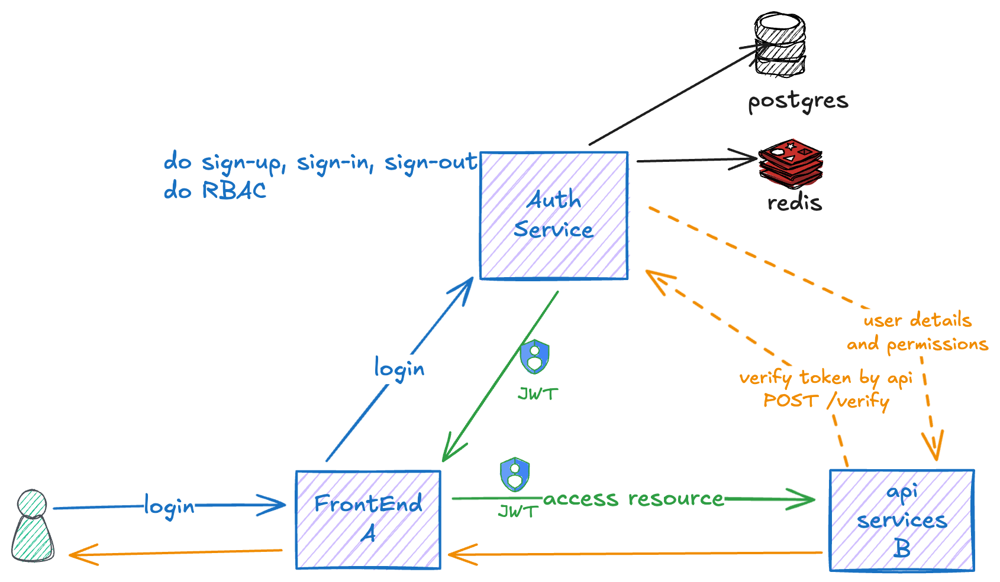

# Auth Service

## 🌟 Overview



The **Auth Service** is a microservice responsible for handling user authentication, authorization, and role-based access control (RBAC) in a distributed system. It provides a centralized solution for user management, token-based authentication using JSON Web Tokens (JWT), and access control for multiple API services. The service supports user sign-up, sign-in, sign-out, multi-factor authentication (MFA), and token revocation, ensuring secure access to protected resources.

### 🏗️ Architecture 
The system consists of three main components:
- **Frontend (A)**: The client application where users log in, sign up, or access protected resources.
- **Auth Service**: The core service that manages authentication, issues JWTs, and enforces RBAC.
- **API Services (B)**: Backend services that provide protected resources, accessible using JWTs issued by the Auth Service.

### 🚀 Usage Scenario
1. A user logs in via the frontend by sending credentials to the Auth Service.
2. The Auth Service validates the credentials and issues a JWT containing the user’s details and a list of accessible services with their roles.
3. The frontend sends the JWT to an API Service to access a protected resource.
4. The API Service verifies the JWT using a shared secret and checks if its own service UUID is in the JWT’s `services` array, along with the user’s role for that service.
5. If the token is valid and the user has access, the API Service grants the request; otherwise, it denies it.
6. Revoked tokens (e.g., after sign-out) are stored in Redis, accessible to all services for blacklist checks.

## Development 🧑‍💻

#### Prerequisites

- Docker and Docker Compose for containerized development.
- uv installed for dependency management.

#### Running the Service

1. Clone the repository:
2. Running the service:
    ```bash
    make up
    ```
3. Running the migrations:
    ```bash
    make exec
    # loc: /code/src
    alembic upgrade head
    ```

#### Project Structure
```bash
├── src/                    # Main code lives here! ❤️
│   ├── alembic.ini             # 🛠️ Config for database migrations. 
│   ├── app/                    # 🚀 FastAPI app code—your API! 
│   ├── frontend/               # 🌐 Frontend files (if any). [Not used yet]
│   ├── migrations/             # 📜 Database migration scripts. 
│   ├── tests/                  # ✅ Tests using pytest. 
│   └── worker/                 # ⚙️ Background task code. [Not used yet]
├── assets/                 # Static files like images.
├── README.md               # 📖 Project info and guide. 
├── Dockerfile              # 🐳 Builds the app’s Docker image. 
├── Dockerfile.dev          # 🐳 Docker setup for development.
├── docker-compose.yaml     # 🎻  Runs multiple services together. 
├── Makefile                # 📋 Shortcuts for common tasks. 
├── pyproject.toml          # 🐍 Python tool and dependency config. 
├── ruff.toml               # 🧹 Linter settings for clean code. 
└── uv.lock                 # 🔒 Locks dependency versions. 
```

## Features

### Authentication 🔑
- `POST /api/v1/auth/sign-up`: Register a new user.
- `POST /api/v1/auth/sign-in`: Authenticate a user and issue a JWT.
- `DELETE /api/v1/auth/sign-out`: Invalidate a user’s session (sign out) and add the token to a Redis blacklist.
- `POST /api/v1/auth/verify-mfa`: Verify multi-factor authentication codes.
- `POST /api/v1/auth/refresh`: Refresh an expired JWT using a refresh token.

### User Management (Admin) 👤
- `GET /api/v1/admin/users`: Retrieve a list of all users (admin only).
- `GET /api/v1/admin/users/{user_uuid}`: Get details of a specific user (admin only).
- `PUT /api/v1/admin/users/{user_uuid}`: Update a user's details (admin only).
- `DELETE /api/v1/admin/users/{user_uuid}`: Delete a user (admin only).
- `PUT /api/v1/admin/users/{user_uuid}/services`: Update service mappings for a user, replacing all existing mappings (admin only).

### Member Profile Management 🧑‍💻
- `GET /api/v1/me`: Retrieve the authenticated user’s details.
- `PUT /api/v1/me`: Update the authenticated user’s profile.
- `PUT /api/v1/me/password`: Update the user’s password.
- `PUT /api/v1/me/mfa`: Enable or update MFA settings.
- `GET /api/v1/me/mfa/qrcode`: Generate a QR code for MFA setup.

### Role Management 🎭
- `GET /api/v1/roles`: Retrieve all roles (admin only).
- `POST /api/v1/roles`: Create a new role (admin only).
- `GET /api/v1/roles/{role_id}`: Get details of a specific role (admin only).
- `PUT /api/v1/roles/{role_id}`: Update a role (admin only).
- `DELETE /api/v1/roles/{role_id}`: Delete a role (admin only).

### Business Role Management 💼
- `GET /api/v1/business-roles`: Retrieve all business roles with pagination (admin only).
- `POST /api/v1/business-roles`: Create a new business role (admin only).
- `GET /api/v1/business-roles/{business_role_id}`: Get details of a specific business role (admin only).
- `PUT /api/v1/business-roles/{business_role_id}`: Update a business role (admin only).
- `DELETE /api/v1/business-roles/{business_role_id}`: Delete a business role (admin only).

### Service Management 🛠️
- `GET /api/v1/services`: Retrieve all services (admin only).
- `POST /api/v1/services`: Create a new service (admin only).
- `GET /api/v1/services/{service_uuid}`: Get details of a specific service (admin only).
- `PUT /api/v1/services/{service_uuid}`: Update a service (admin only).
- `DELETE /api/v1/services/{service_uuid}`: Delete a service (admin only).

## Security Features
- **JWT Authentication**: Uses JSON Web Tokens for stateless authentication, signed with a shared secret.
- **Rate-Limiting**: All API endpoints are rate-limited to prevent brute-force attacks.
- **Password Hashing**: Passwords are stored in the database as hashed values using a secure algorithm.
- **Token Revocation**: Revoked tokens are stored in Redis, accessible to all services for blacklist checks.
- **RBAC**: Role-based access control ensures users can only access endpoints permitted by their roles.
- **MFA**: Multi-factor authentication is supported for added security.

## Example JWT Payload
Below is a simplified example of a JWT payload issued by the Auth Service. The current implementation includes detailed user information and a `services` array, but this can be optimized (see "Things to Improve").

```json
{
  "created_at": "2025-03-17 01:20:41.960130+00:00",
  "created_by": null,
  "updated_at": "2025-03-21 03:09:44.881722+00:00",
  "updated_by": null,
  "uuid": "0195a1b0-517f-7460-90e6-7a034be7a589",
  "username": "johndoe",
  "firstname": "John",
  "midname": "Mid Name",
  "lastname": "Choy",
  "email": "johndoe@email.com",
  "phone": "081214341127",
  "telegram": null,
  "is_active": true,
  "mfa_enabled": false,
  "role": "superadmin",
  "services": [
    {
      "uuid": "0195a20d-436d-7eb5-a419-a699b876f020",
      "name": "central",
      "description": "central service",
      "role": "superadmin",
      "member_is_active": true,
      "service_is_active": true
    }
  ],
  "expire_time": 1742536391.0627003
}
```

### Notes on Current JWT
The current JWT payload includes more data, such as `email`, `phone`, and a `services` array with the user’s accessible services and roles. This has been simplified in the example above to reduce token size and improve security, as sensitive data should not be stored in the JWT.

## ✅ Things to Improve 
- [X] **Standardize Error Responses**: Implement a consistent error response format across all endpoints for better client-side handling.
- [ ] **Improve Verification Access to from Auth Service to API Services**: Implement a more secure method for API Services to verify JWTs, such as using public/private key pairs instead of a shared secret.
- [ ] **Simplify JWT Payload**: Remove sensitive data (e.g., `email`, `phone`) and the `services` array from the JWT to reduce its size and minimize data exposure risks.
- [ ] **Maybe, Centralize Permission Checks**: Store service access and roles in a database (cached in Redis) and create an endpoint (e.g., `GET /api/v1/auth/permissions`) for services to dynamically check user access and roles.
- [ ] **Implement Logging and Monitoring**: Add logging for all authentication and authorization events to enable auditing and monitoring of access attempts.
- [ ] **Build a Frontend**: Create a simple frontend application to demonstrate the Auth Service's functionality and provide a user-friendly interface for authentication and user management.
- [ ] **Add Tests**: Implement unit and integration tests to ensure the reliability and correctness of the Auth Service.
- [ ] **Improve Documentation**: Enhance the README and API documentation to provide clearer instructions and examples for developers using the Auth Service.